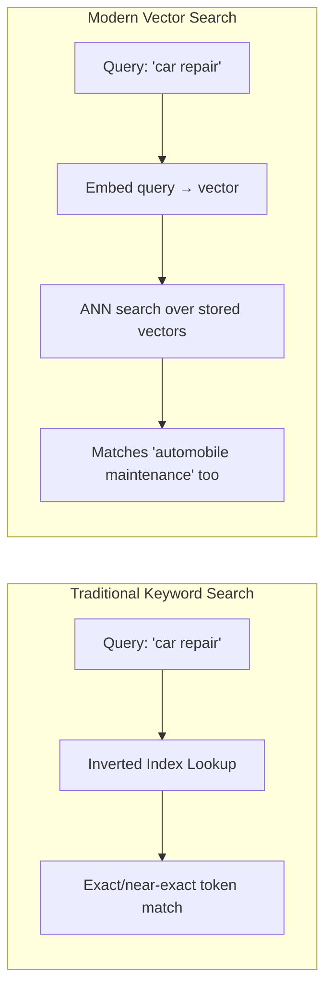
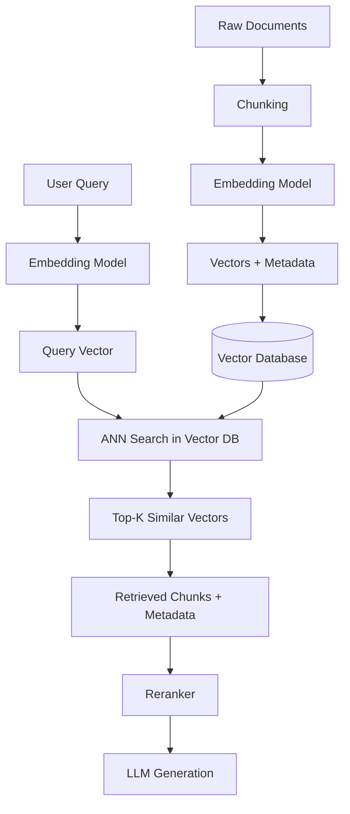

# Vector Databases — Study Notes (Interview Prep)

## Why Vector Databases?

### The Shift From Keywords to Meaning

Recall the whole arc of your notes so far: keyword search matches literal tokens (TF-IDF/BM25), while embeddings (Sentence Transformers) represent *meaning* as vectors. A vector database is the piece of infrastructure that exists specifically to store and search **those vectors** at scale — it's the storage/retrieval layer that makes semantic search operationally possible, not just theoretically possible.

### Traditional Keyword Search vs. Modern Vector Search

| | Traditional Keyword Search | Modern Vector Search |
|---|---|---|
| **Matches on** | Exact tokens | Semantic meaning |
| **Data structure** | Inverted index | Vector index (HNSW, IVF) |
| **Storage unit** | Raw text + term positions | High-dimensional embeddings |
| **Query cost** | Cheap index lookup | Embed query + ANN search |
| **Strength** | Precision on exact terms, codes, names | Handles synonyms, paraphrase, concepts |
| **Weakness** | Misses paraphrased/synonymous matches | Weaker on exact rare-token matches |
| **This is covered in** | Your TF-IDF / BM25 notes | Your Embedding Models / Sentence Transformers notes |

**Interview soundbite:** *"Keyword search indexes words; vector search indexes meaning. A vector database is purpose-built to store embeddings and answer 'what's semantically closest to this vector' at scale — something a relational database or a plain inverted index isn't optimized to do."*

---

## What Is a Vector Database?

1. **Specialized Storage** — purpose-built for storing and searching embeddings, rather than rows/columns or plain text.
2. **Rich Connections** — every stored vector is linked back to its original document/chunk plus metadata (source, timestamp, ACL tags — see your Retrieval Methods notes), so a vector match can be traced back to something meaningful and filterable.
3. **Optimized Search** — implements ANN indexing (HNSW, IVF — your Vector Search notes) internally, so nearest-neighbor retrieval stays fast even over millions or billions of vectors.

**Interview framing:** a vector database is really "a database whose primary index structure is built for approximate nearest-neighbor search over high-dimensional vectors, with metadata filtering bolted on" — not a fundamentally different kind of database in terms of concepts like durability/replication, just optimized around a different query pattern.

---

## The Vector Database Workflow

This is the full pipeline your notes have been building toward: **ingest → chunk → embed → store (vector DB) → query-time embed → ANN search → rerank → generate.** The vector database specifically owns the "store" and "ANN search" steps — everything before it is preparation, everything after it is refinement.

---

## Fast Search at Scale

The reason a vector database can return results from millions of vectors in milliseconds is the same ANN indexing covered in your Vector Search notes:

- **HNSW** — a navigable graph structure, searched by hopping from coarse to fine layers.
- **IVF / IVF-PQ** — vectors pre-clustered into buckets, so search only checks the nearest cluster(s).

A vector database wraps one of these (often configurable) plus the operational features a real system needs: persistence, replication, metadata filtering, incremental updates (adding new vectors without rebuilding the whole index), and a query API. **This operational layer — not the ANN algorithm itself — is usually the actual value a vector database product adds over a bare library.**

---

## Why Vector Databases Matter for RAG

- **They're the retrieval backbone** — every RAG query's "context retrieval" step (from your "Why RAG Needs Embeddings" notes) is a vector database query under the hood.
- **They enable dynamic knowledge** — new documents can be embedded and inserted without retraining the LLM, exactly as your Embedding Models notes covered.
- **They support metadata filtering alongside similarity** — e.g., "find the closest vectors, but only among documents this user's tenant is allowed to see" — directly solving the ACL Leak failure mode from your Retrieval Methods notes.
- **They scale where naive comparison can't** — brute-force comparing a query against every vector is fine for a demo with 1,000 chunks; it falls over completely at production scale, which is exactly the gap ANN indexing (and the databases built around it) fill.

---

## Best Practices for Success

- **Choose an index type deliberately** — HNSW generally favors query speed and recall at higher memory cost; IVF-family indexes trade some accuracy for lower memory footprint at very large scale. Pick based on your actual data size and latency budget, not by default.
- **Store rich metadata alongside vectors** — you'll almost always need to filter (by tenant, date, document type) in addition to similarity search; retrofitting this later is painful.
- **Monitor index freshness** — a vector DB that isn't updated when source documents change silently becomes a "Stale Index" failure mode (your Retrieval Methods notes) — plan for incremental updates or scheduled reindexing.
- **Benchmark recall vs. latency for your own data** — the efSearch/nprobe tuning trade-off is workload-specific; don't assume default settings are right for your corpus size and query patterns.
- **Combine with keyword/hybrid search** — a vector database alone still inherits vector search's weaknesses (rare exact-term matches) — most production RAG systems pair it with BM25 (your Keyword Search / Hybrid Search notes), not as a replacement.

---

## Choosing the Right Tool

| Tool | Type | Good Fit When |
|---|---|---|
| **Pinecone** | Managed cloud service | You want a fully managed, low-ops solution and are fine with a hosted/paid service. |
| **Weaviate** | Open-source, can self-host or use managed cloud | You want built-in hybrid search and a flexible schema, self-hosted or managed. |
| **Milvus** | Open-source, built for large scale | You're operating at very large vector counts and need strong horizontal scaling. |
| **Qdrant** | Open-source, self-host or managed | You want a lightweight, fast, developer-friendly option with strong filtering support. |
| **pgvector** | PostgreSQL extension | You already run Postgres and want vector search without adding a whole new system — great for smaller-to-medium scale. |
| **Chroma** | Lightweight, embedded/open-source | You're prototyping or building something small/local — very low setup friction. |
| **FAISS** | Library, not a full database | You need raw ANN search performance and are willing to build storage/persistence/filtering yourself — a building block, not a turnkey system. |

**Interview soundbite:** *"There's no single 'best' vector database — it depends on scale, whether you want managed vs. self-hosted, whether you already have infrastructure (e.g., Postgres) you'd rather extend, and whether you need hybrid search built in. FAISS is the odd one out — it's a library for the ANN algorithm itself, not a full database with persistence and metadata filtering."*

---

## Interview Q&A Quick-Fire

**Q: What's the difference between a vector database and a traditional database?**
A: A traditional database is optimized for exact-match/range queries over structured rows (via B-tree/hash indexes); a vector database is optimized for approximate nearest-neighbor search over high-dimensional embeddings, using ANN indexes like HNSW or IVF.

**Q: Why "approximate" nearest neighbor, not exact?**
A: Exact nearest-neighbor search over millions/billions of high-dimensional vectors is too slow for real-time queries. ANN indexes trade a small, tunable amount of accuracy for a large gain in speed (the efSearch/nprobe knobs from your Vector Search notes).

**Q: How does a vector database fit into a RAG pipeline?**
A: It's the storage and retrieval layer — documents are chunked, embedded, and stored in it at ingestion time; at query time, the query is embedded and the database returns the top-K most similar vectors, which then get reranked and passed to the LLM as context.

**Q: What's the trade-off between HNSW and IVF?**
A: HNSW generally gives better recall and query speed but uses more memory (it's a graph with many links); IVF-family indexes use less memory and scale to larger datasets more cheaply, at some cost to recall unless tuned carefully (higher nprobe).

**Q: Why would you combine a vector database with keyword search instead of using vector search alone?**
A: Vector search can miss exact-match cases (product codes, rare technical terms) that aren't well represented in embedding space — combining it with BM25 (hybrid search) covers both failure modes, since each approach's weakness is the other's strength.

**Q: How do you handle access control (multi-tenant data) in a vector database?**
A: Store ACL/tenant metadata alongside each vector, and apply metadata filtering *at retrieval time* (not after) — otherwise a similarity match could surface a chunk the requesting user isn't authorized to see (the ACL Leak failure mode).

---

## Quick Recap

- A vector database is a specialized store for embeddings, built around ANN indexing (HNSW/IVF) for fast approximate similarity search, with metadata attached for filtering and traceability.
- It replaces "does this document contain these words" (keyword search) with "what's semantically closest to this query" — but doesn't replace keyword search entirely, since production systems typically combine both (hybrid search).
- The core workflow: chunk → embed → store in vector DB → embed query → ANN search → rerank → generate — the vector DB owns storage and search, not the surrounding pipeline steps.
- Choosing a tool is a real trade-off between managed vs. self-hosted, scale, existing infrastructure, and whether you need hybrid search built in — there's no universal "best," which is itself a good interview answer.
