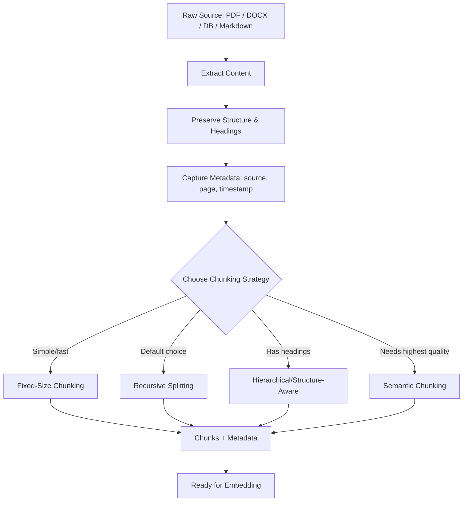

# Document Ingestion & Chunking — Study Notes

## 1. Document Ingestion

Ingestion is the very first step of the **offline** half of RAG (see your pipeline note, section 2A) — before anything can be chunked or embedded, it has to be pulled out of whatever format it's locked in.

**Goals of ingestion:**

| Goal | What It Means |
|---|---|
| **Extract Content** | Pull raw text out of any source format (PDF, DOCX, HTML, images, audio, etc.), not just plain `.txt`. |
| **Preserve Context** | Keep headings, structure, and relationships (e.g., which paragraph belongs to which section) — flattening everything to raw text throws this away. |
| **Capture Metadata** | Record source file, page number, document type, author, timestamp, etc. This is what lets you *cite* an answer later, not just retrieve it. |

**Why this matters:** bad ingestion silently caps the quality of everything downstream. If you lose a table's structure or merge two unrelated columns into one string, no amount of clever chunking or reranking will recover that meaning.

### Three Pillars of RAG Source Data

| Type | Description | Examples | Typical Tools |
|---|---|---|---|
| **Unstructured** | Free-form text with no fixed layout | Plain `.txt`, Markdown, chat logs, emails | Simple file readers, `langchain` `TextLoader` |
| **Semi-Structured** | Layout carries meaning (columns, headers, tables), but not a rigid schema | PDF, DOCX, HTML, PPTX | `unstructured.io`, `PyMuPDF`, `python-docx`, OCR tools |
| **Structured** | Fixed schema, rows/columns | Databases (SQL), spreadsheets, CSV | SQL connectors, `pandas`, spreadsheet loaders |

The further right you go on this table, the more ingestion logic you need (e.g., a PDF ingester has to decide whether a block of text is a heading, a footnote, or a table cell — a `.txt` file never asks that question).

---

## 2. Chunking Strategies

**Why chunk at all?** Embedding models and LLM context windows both have limits, and retrieval works best over small, focused, semantically coherent pieces of text — not entire documents. Good chunking is what makes retrieval *precise* instead of *vague*.

### Anatomy of a Good Chunk

| Property | What It Means |
|---|---|
| **Coherence** | Self-contained and semantically complete — a chunk shouldn't require the previous or next chunk to make sense. |
| **Size** | "Just right" — small enough to fit cleanly into an embedding/context window, large enough to preserve meaning. |
| **Overlap** | ~10–20% overlap between adjacent chunks, so ideas that straddle a boundary aren't lost entirely to one side. |
| **Natural Boundaries** | Split on logical breaks (paragraphs, code blocks, list items) rather than an arbitrary character count. |
| **Source Metadata** | Every chunk should carry its origin (document, page, section, timestamp) so retrieval results can be traced back and cited. |

---

### Strategy 1: Fixed-Size Chunking

Splits text every *N* characters or tokens, with no awareness of sentence, paragraph, or semantic boundaries.

- ✅ **Advantages:** Trivial to implement, fast, predictable chunk sizes (good for token-budget planning).
- ❌ **Disadvantages:** Can cut a sentence, table, or code block in half; a chunk near a split point may make no sense on its own, which directly hurts retrieval quality and embedding meaning.

**When to use it:** quick prototypes, or genuinely unstructured text where "meaning" isn't really layout-dependent anyway.

---

### Strategy 2: Context-Aware Splitting

Splits on natural delimiters — paragraph breaks, sentence boundaries — instead of a raw character count.

- ✅ **Advantages:** Chunks are much more likely to be semantically complete than fixed-size chunks.
- ❌ **Disadvantages:** Chunk sizes become uneven (a one-line paragraph and a 500-word paragraph are both "one chunk"), which can complicate downstream token-budgeting.

---

### Strategy 3: Recursive Splitting — the Go-To Strategy

The most commonly used default (e.g., LangChain's `RecursiveCharacterTextSplitter`). The key idea is a **fallback hierarchy of separators**, not just "split by paragraphs":

1. Try splitting on the biggest natural boundary first — paragraph breaks (`\n\n`).
2. If a resulting chunk is *still* over the size limit, recursively split that chunk on the next separator — line breaks (`\n`).
3. If still too big, fall back further — sentences, then words, then raw characters as a last resort.

This way it respects structure wherever possible, but still guarantees every chunk stays within your size limit.

- ✅ **Advantages:** Good balance of structure-awareness and reliability; works well as a sensible default across most document types.
- ❌ **Disadvantages:** Still purely structural — it has no idea whether two consecutive paragraphs are about completely different topics.

---

### Strategy 4: Structure-Aware / Hierarchical Splitting

Splits by hierarchical headers (H1, H2, H3) or Markdown heading levels (`#`, `##`, `###`) to keep whole sections intact.

- ✅ **Advantages:** Preserves document hierarchy and topical grouping — great for well-structured docs like manuals, wikis, or Markdown notes (like this one!).
- ❌ **Disadvantages / Limitations:** Useless on documents without consistent heading structure; a single section under one header can still be huge and need further sub-splitting (often combined with recursive splitting *within* each section).

---

### Strategy 5: Semantic Chunking

Uses embedding models to detect topic shifts and splits content where the topic actually changes, rather than at a structural marker.

**How it works:**
1. **Embed Sentences** — generate an embedding for each sentence (e.g., with a Sentence-Transformers model).
2. **Compute Similarity** — measure cosine similarity between each pair of adjacent sentence embeddings.
3. **Detect Topic Shifts** — when similarity drops below a set threshold, that's treated as a topic boundary and a chunk split point.

- ✅ **Advantages:** Chunk boundaries track actual meaning, not just formatting — often the highest-quality chunks for retrieval.
- ❌ **Disadvantages:** Expensive — an embedding call per sentence adds real latency and cost at ingestion time; also sensitive to the similarity threshold you pick (too strict = tiny fragmented chunks, too loose = boundaries barely differ from doing nothing).

---

### Decision Framework: Choosing Your Strategy

1. **Start with Recursive Splitting.** It's the safe, cheap default for most document types.
2. **Test retrieval quality rigorously.** Don't just eyeball chunk boundaries — measure actual retrieval accuracy on real queries.
3. **Upgrade to Semantic Chunking if needed.** Reach for this only if recursive splitting is demonstrably hurting retrieval on topic-dense or loosely-structured documents — it costs more, so earn the upgrade with evidence.
4. **Consider hybrid approaches.** e.g., structure-aware splitting at the section level, then recursive (or semantic) splitting *within* each section — combining the strengths of both.

---

## Quick Recap

- Ingestion = extract + preserve structure + capture metadata, across unstructured, semi-structured, and structured sources.
- A good chunk is coherent, right-sized, overlapping slightly with neighbors, split on natural boundaries, and tagged with source metadata.
- Fixed-size = fast but dumb. Context-aware = respects structure. Recursive = fallback hierarchy of separators, the default choice. Hierarchical = respects document headings. Semantic = tracks actual meaning, but costs more.
- Default to recursive splitting, measure retrieval quality, and only upgrade to semantic (or hybrid) chunking when the data justifies it.

---

## Diagram: Ingestion → Chunking Pipeline

## Interview Q&A Quick-Fire

**Q: Why not just feed whole documents to the LLM instead of chunking?**
A: Context windows and embedding models both have size limits, and retrieval works best over small, focused pieces of text — a whole document dilutes the signal and makes it harder for similarity search to isolate the relevant part.

**Q: What's the risk of fixed-size chunking?**
A: It can slice a sentence, table, or code block in half at an arbitrary character count, producing chunks that are semantically broken and hurt both embedding quality and retrieval precision.

**Q: Why is Recursive Splitting the common default?**
A: It tries the largest natural boundary first (paragraphs), and only falls back to smaller boundaries (lines, sentences, characters) if a chunk is still too big — balancing structure-awareness with a guaranteed size limit.

**Q: When would you reach for semantic chunking over recursive splitting?**
A: When recursive splitting is demonstrably hurting retrieval quality on topic-dense or loosely-structured text — it's more expensive (an embedding call per sentence), so it should be justified by evidence, not used by default.

**Q: Why does chunk overlap matter?**
A: Without overlap, an idea that spans a chunk boundary can be split so that neither chunk fully contains it — a 10-20% overlap keeps boundary-straddling concepts retrievable from at least one chunk.
