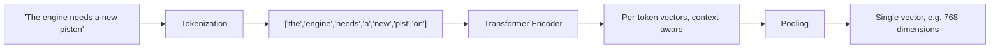

# Embedding Models — Study Notes

## The Limitation of Keyword Matching (Recap)

From your Keyword Search notes: pure keyword matching has two core problems —

1. **Context and intent are ignored** — the words matter, the meaning behind them doesn't.
2. **Users must guess exact terms** — if you don't happen to phrase your query the way the document is phrased, you get nothing.

This is exactly why we need **semantic search** — retrieval that understands *meaning*, not just literal text. Embeddings are the mechanism that makes semantic search possible at all.

---

## What Is an Embedding?

A **numerical vector** — text (a word, sentence, or chunk) is converted into an array of floating-point numbers that represents its *meaning* as a point in high-dimensional space.

- **Semantic Distance:** texts with similar meaning end up as vectors that are close together in that space — regardless of whether they share any actual words.
- **Mathematical Comparison:** because meaning is now just numbers, "how similar are these two texts" becomes a math problem — measuring the distance (or angle) between two vectors produces a similarity score.

**Concrete scale:** a real embedding isn't a handful of numbers — common models output vectors of **384, 768, or 1536 dimensions** (sometimes more). Each dimension doesn't correspond to a human-readable concept on its own; the *meaning* lives in the overall pattern across all of them together.

---

## How Embeddings Are Created

```
Text Input
   │
   ▼
Tokenization
   │
   ▼
Neural Network (encoder)
   │
   ▼
Vector Output
```

- **Text Input:** the raw sentence, query, or chunk you want to embed.
- **Tokenization:** the text is broken into smaller units — sub-word pieces, not always whole words (e.g., "chunking" might become "chunk" + "ing"). This is the same underlying idea as splitting text for an LLM's context window, just feeding a different kind of model.
- **Neural Network (encoder):** each token is turned into an initial vector, then passed through multiple transformer layers where tokens exchange information with each other — this is what lets the model capture *context* (recall your Polysemy notes: "bank" gets a different representation depending on its neighboring words). The result is one vector per token.
- **Pooling → Vector Output:** since a sentence has many tokens but you usually want *one* embedding for the whole sentence/chunk, the per-token vectors are combined (commonly averaged, or the model's dedicated `[CLS]`-style summary token is used) into a single fixed-size vector — that final vector is "the embedding."

---

## Where Embeddings Live (In a RAG Pipeline)

1. **Text Conversion:** both documents (at ingestion time) and user queries (at query time) get converted into embeddings, using the *same* embedding model — this consistency is essential, since comparing vectors from two different models is meaningless.
2. **Vector Storage:** document embeddings are stored in a **vector database**, typically indexed with an ANN structure (HNSW/IVF — see your Vector Search notes) so nearest-neighbor lookup stays fast at scale.
3. **Query Processing:** the user's query is embedded the same way, on the fly, at request time.
4. **Similarity Search:** the query vector is compared against stored document vectors, and the closest ones (by similarity score) are returned as candidates.

**How similarity is actually measured:** the most common metric is **cosine similarity** — the angle between two vectors, ignoring their magnitude. You've already used this exact concept in your Semantic Chunking notes ("compute cosine similarity between adjacent [sentence] embeddings"), just applied there to detect topic shifts within a document instead of matching a query to a document. Other options exist (dot product, Euclidean distance), but cosine similarity is the default for most embedding models because it's scale-invariant — two vectors pointing the same direction score as similar even if one happens to have a larger magnitude.

---

## Why RAG Needs Embeddings

```
User Query → Query Embedding → Vector Search → Context Retrieval → LLM → Answer
```

1. **Semantic Matching:** queries and documents are embedded into the *same* vector space, so retrieval can find genuinely relevant content even when the wording doesn't match at all — directly solving the two keyword-search limitations from the top of this note.
2. **Reduced Hallucinations:** grounding the LLM's answer in retrieved, relevant context (instead of relying purely on what it memorized during training) measurably improves factual accuracy.
3. **Dynamic Knowledge:** new information can be added to the system just by embedding and indexing it — no need to retrain or fine-tune the LLM itself to make it "aware" of new documents.

---

## Choosing the Right Embedding Model

This is a real practical decision, not a footnote — the choice affects retrieval quality, cost, and speed throughout the whole pipeline.

| Factor | What to Consider |
|---|---|
| **Dimension Size** | More dimensions can capture more nuance, but cost more storage and make similarity search slower — 768–1536 is a common practical range. |
| **Domain Fit** | A general-purpose model (trained on broad web text) may underperform a domain-tuned one on specialized text — legal, medical, or code-heavy content often benefits from a model trained/fine-tuned on that domain. |
| **Context Window** | Every embedding model has a max input length (in tokens); text longer than that gets truncated silently unless you chunk first — this is exactly why chunking (your Chunking notes) has to happen *before* embedding. |
| **Open-Source vs. API** | Open-source models (e.g., Sentence-Transformers) run locally — no per-call cost, but you manage the infrastructure. API-based models (e.g., OpenAI, Cohere) are simpler to integrate but bill per token and add network latency. |
| **Benchmark Performance** | Leaderboards like MTEB (Massive Text Embedding Benchmark) compare models across many retrieval/similarity tasks — a reasonable starting point, though your own data's characteristics can matter more than a generic leaderboard rank. |
| **Cost & Latency** | Larger, higher-quality models are typically slower and pricier per embedding — worth benchmarking against your actual latency budget (see your Retrieval Methods notes on time budgets) rather than just picking the "best" model on paper. |

**Rule of thumb:** start with a well-regarded general-purpose model, measure retrieval quality on your actual data (same "evaluate thoroughly" principle from your Keyword Search checklist), and only move to a specialized or larger model if you have evidence it's needed.

---

## Quick Recap

- Embeddings turn text into numerical vectors positioned so that similar *meaning* ends up close together — this is the foundation semantic search is built on.
- Creation pipeline: text → tokenization → transformer encoder (captures context) → pooling into one fixed-size vector.
- In a RAG pipeline, both documents and queries are embedded with the *same* model, stored/indexed in a vector database, and compared via similarity search — most commonly cosine similarity, the same metric you already used in Semantic Chunking.
- Embeddings are what let RAG do semantic matching, reduce hallucination through grounding, and add new knowledge without retraining the LLM.
- Choosing a model is a real trade-off between dimension size, domain fit, context window, cost/latency, and open-source vs. API — start general-purpose, then specialize only with evidence.

---

## Diagram: Text to Embedding, Step by Step



## Interview Q&A Quick-Fire

**Q: What does "pooling" mean in the context of embeddings?**
A: Combining many per-token vectors (produced by the encoder) into a single fixed-size vector representing the whole sentence/chunk — commonly by averaging or using a dedicated summary token.

**Q: Why must the query and documents be embedded with the same model?**
A: Different models place text in different, incompatible vector spaces — comparing a query vector from one model against document vectors from another produces meaningless similarity scores.

**Q: What's a practical consequence of an embedding model's context window limit?**
A: Text longer than the model's max input length gets silently truncated unless you chunk it first — which is exactly why chunking must happen *before* embedding, not after.

**Q: How would you choose between an open-source and an API-based embedding model?**
A: Open-source models run locally with no per-call cost but require you to manage infrastructure; API models are simpler to integrate but bill per token and add network latency — the choice depends on scale, cost sensitivity, and ops capacity.
