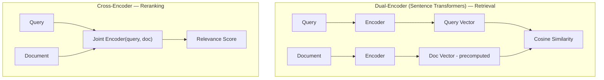

# Sentence Transformers — Study Notes

## Two Sentences, Same Meaning

Sentence Transformers understand *meaning*, not just words — they represent entire sentences as numerical vectors that preserve semantic relationships. Two sentences phrased completely differently but meaning the same thing end up as nearby vectors.

### Where We Are in the Journey

1. **Keyword Search** — basic text matching (your Keyword Search notes)
2. **Embeddings** — numerical representations of text (your Embedding Models notes)
3. **Sentence Transformers** — semantic understanding at the *sentence* level (this note)
4. **Similarity Matching** — finding relevant context via vector comparison
5. **RAG Systems** — context-aware generation, built on all of the above

---

## From Word → Sentence → Meaning

| Model Type | What It Captures | Limitation |
|---|---|---|
| **Word2Vec** | Individual word embeddings — captures word-level relationships (e.g., "king" − "man" + "woman" ≈ "queen"). | One fixed vector per word, regardless of context — "bank" gets the same vector in "river bank" and "savings bank" (this is the Polysemy problem from your Keyword Search notes). |
| **BERT / RoBERTa** | Contextualized token representations — the vector for a word now shifts based on surrounding words, fixing Word2Vec's context-blindness. | Produces one vector *per token*, not one vector for the whole sentence — there's no built-in "sentence embedding." |
| **Sentence Transformers** | Full sentence embeddings — a single vector capturing the complete semantic meaning of an entire sentence or chunk. | Requires specific training (below) to actually produce *useful* sentence-level similarity — this doesn't come for free. |

### The Missing Step: Why Not Just Use BERT Directly?

This is the actual gap in the table above worth understanding. BERT does produce a special summary token (`[CLS]`) that in theory could represent "the whole sentence" — so why not just use that as a sentence embedding?

In practice, raw BERT `[CLS]` embeddings perform surprisingly *poorly* at sentence similarity tasks — worse than much simpler methods, in some benchmarks. The reason: BERT was trained for tasks like masked-word prediction, not for "are these two sentences similar," so its embedding space isn't naturally organized in a way where distance reflects semantic similarity. **Sentence Transformers fix this by fine-tuning specifically on similarity tasks** (see below), reshaping the embedding space so that distance *does* correspond to meaning. This is the actual innovation — not a new architecture from scratch, but BERT-style models retrained with a similarity-focused objective.

---

## Under the Hood: Dual-Encoder Design

1. **Query Encoder:** transforms the user's query into a semantic embedding.
2. **Document Encoder:** encodes each candidate document/chunk into the same vector space.
3. **Cosine Similarity:** compares the query embedding against document embeddings to find the closest semantic matches (same metric from your Embedding Models notes).

**The key architectural detail — "dual" means independent:** the query and document are each encoded *separately*, with no interaction between them during encoding. This is exactly what makes retrieval fast: every document's embedding can be precomputed once, offline, and stored in a vector database — at query time, you only need to encode the *query* and compare it against those precomputed vectors.

### Dual-Encoder vs. Cross-Encoder (Link to Your Reranking Notes)

Recall from your Reranking notes: cross-encoders score a query and document *together*, jointly — that's what makes them slow but precise, and why they're only run over a small reranking shortlist rather than a whole corpus.

| | Dual-Encoder (Sentence Transformers) | Cross-Encoder |
|---|---|---|
| **Encoding** | Query and document encoded independently | Query and document encoded together, jointly |
| **Speed** | Fast — document embeddings precomputed once | Slow — must be recomputed per query-document pair |
| **Precision** | Good, but a coarser approximation | Higher — captures fine-grained interaction between query and document |
| **Role in RAG** | Initial retrieval (this note) | Reranking (your Reranking notes) |

This is the exact same fast-vs-precise trade-off you've now seen twice — Sentence Transformers are the "initial retrieval" half of that trade-off, cross-encoders are the "reranking" half.

---

## Fine-Tuning Through Similarity Tasks

Sentence Transformers are trained (or fine-tuned from a base model like BERT) specifically on tasks that force the embedding space to reflect meaning:

1. **Natural Language Inference (NLI):** understanding entailment (does sentence A imply sentence B?) and contradiction between sentence pairs.
2. **Paraphrase Detection:** learning to identify sentences that convey the same meaning despite different wording.
3. **Semantic Textual Similarity (STS):** training directly on human-labeled scores for "how similar are these two sentences," so the model learns to produce distances that match human judgment of similarity.

Training on these tasks is what reshapes the embedding space so that "close in vector space" reliably means "similar in meaning" — solving the exact BERT `[CLS]` shortcoming described above.

---

## Popular Sentence Transformer Models

A few widely used examples, spanning the size/quality trade-off from your Embedding Models notes:

- **all-MiniLM-L6-v2** — small, fast, 384-dimension embeddings; a common default for lightweight or latency-sensitive RAG setups.
- **all-mpnet-base-v2** — larger, higher-quality general-purpose model, 768 dimensions.
- **multilingual variants (e.g., paraphrase-multilingual-mpnet-base-v2)** — trained across many languages, enabling cross-lingual semantic search (see below).
- **Domain-specific fine-tunes** — e.g., legal-BERT or BioBERT-derived sentence encoders, tuned for specialized vocabulary.

---

## Semantic Glue for RAG Systems

```
User Query → Sentence Transformer → Vector Search → Top Results → LLM Generation
```

Sentence Transformers act as the **retrieval engine** at the heart of this flow:

1. **Act as retrieval engines** — turning both queries and documents into comparable vectors.
2. **Understand what the query means**, not just its literal words.
3. **Interpret word arrangement and relevance** — word order and phrasing shift the embedding, unlike a bag-of-words keyword approach.
4. **Retrieve related documents** — via similarity search over the resulting vector space (your Vector Search notes: HNSW/IVF run on top of these embeddings).

### Query Similarity in Action (Worked Example)

Take two differently-worded queries about the same topic:

- Query A: *"How do I reset my password?"*
- Query B: *"Steps to recover a forgotten login"*

A keyword search would find almost no overlap between these (barely any shared words) and likely miss a relevant document phrased like either one. A Sentence Transformer embeds both into vectors that land close together in semantic space — because the *meaning* (account access recovery) is the same — so a document written using either phrasing would be retrieved for either query. This is the direct, practical payoff of everything above.

---

## Why They're Essential for Modern Search

1. **Capture True Meaning:** understand intent, synonyms, paraphrases, and underlying concepts — not just literal word overlap.
2. **Enable Multilingual Search:** multilingual models embed semantically equivalent sentences from *different languages* into the same shared vector space — a query in English can retrieve a relevant document written in French, because both land near the same point in meaning-space.
3. **Work Fast at Scale:** thanks to the dual-encoder design, document embeddings are precomputed once and reused for millions of subsequent queries — only the query itself needs encoding at request time.
4. **Integrate Easily:** fit into RAG pipelines with minimal setup — libraries like Sentence-Transformers provide ready-to-use pretrained models with a simple API.

---

## Quick Recap

- Sentence Transformers turn whole sentences into single vectors that preserve *meaning*, evolving from Word2Vec (word-level) through BERT (contextual but token-level) to true sentence-level embeddings.
- The key gap they solve: raw BERT `[CLS]` embeddings aren't naturally good at similarity — fine-tuning on NLI, paraphrase detection, and STS tasks is what reshapes the embedding space so distance actually reflects meaning.
- Architecturally, they're dual-encoders: query and document are embedded independently, which is what makes them fast enough for retrieval at scale — the direct counterpart to the cross-encoders used in reranking (jointly-encoded, slower, more precise).
- They're the "semantic glue" of RAG: the mechanism that turns a query into something comparable against a whole corpus of precomputed document vectors, enabling meaning-based (not word-based) retrieval — including across languages.

---

## Diagram: Dual-Encoder vs. Cross-Encoder



## Interview Q&A Quick-Fire

**Q: Why doesn't raw BERT work well for sentence similarity out of the box?**
A: BERT was trained for tasks like masked-word prediction, not similarity — its embedding space isn't naturally organized so that distance reflects meaning. Sentence Transformers fix this by fine-tuning specifically on similarity tasks (NLI, paraphrase detection, STS).

**Q: What makes a dual-encoder fast enough for retrieval at scale?**
A: Query and document are encoded independently — document embeddings can be precomputed once, offline, and only the query needs encoding at request time.

**Q: Why can't you just use a cross-encoder for initial retrieval instead of a dual-encoder?**
A: A cross-encoder must jointly process every query-document pair, which is far too slow to run over an entire corpus — it's reserved for reranking a small shortlist, not scanning millions of candidates.

**Q: What does a multilingual Sentence Transformer enable that a monolingual one can't?**
A: Cross-lingual retrieval — a query in one language can retrieve semantically equivalent documents written in a different language, because both land near the same point in the shared vector space.
