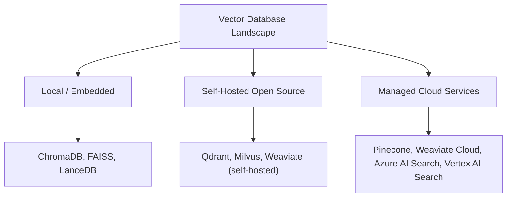
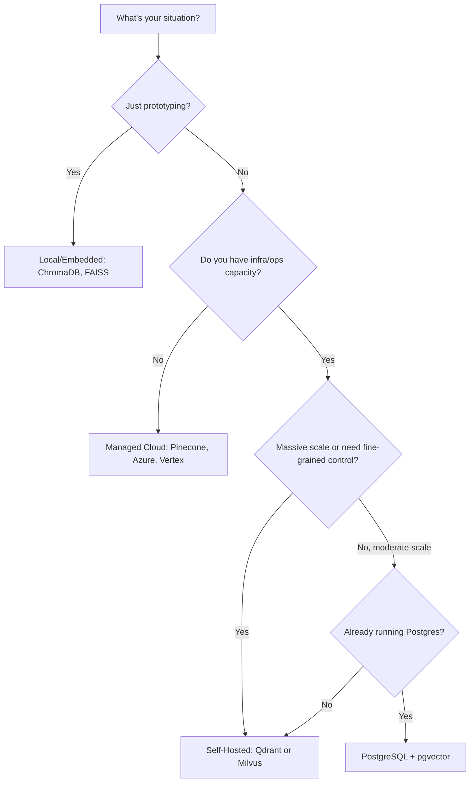

# Vector Database Options for RAG — Selection Guide

Your [Vector Databases](10_vector_databases.md) note covered *what* a vector database is and *why* RAG needs one. This note is the practical follow-up: **which one do you actually pick**, and what breaks in production that a feature comparison table won't warn you about.

---

## What Actually Matters

Five factors that should drive the decision, roughly in the order they tend to bite you:

| Factor | Why It Matters |
|---|---|
| **1. Latency vs. Recall** | Every ANN index (HNSW, IVF — your Vector Search notes) trades search thoroughness for speed. The right balance depends entirely on your product's tolerance for slow-but-accurate vs. fast-but-approximate results. |
| **2. Hybrid Search** | If you need BM25 + vector combined (and most production RAG systems do — your Keyword vs. Semantic Search notes), not every tool supports this natively; some require you to bolt on a separate keyword index yourself. |
| **3. Scale Requirements** | A tool that's effortless at 100K vectors can fall over — or become very expensive — at 500M. Pick based on where you'll be in a year, not just where you are today. |
| **4. Operations Model** | Self-hosting buys control and cost savings but costs engineering time; managed services buy speed-to-production but cost money and some flexibility. |
| **5. Ecosystem Fit** | If your team already runs Postgres, Redis, or a specific cloud provider, a tool that integrates with what you already operate often beats a "better" tool that adds a whole new system to maintain. |

---

## The Landscape at a Glance

### Local / Embedded
Runs inside your application process or on a single machine — no separate server to operate. **Examples:** ChromaDB, FAISS, LanceDB.
- **Best for:** prototyping, small local apps, notebooks, single-machine tools.
- **Not built for:** multi-user production traffic, horizontal scale, or high availability.

### Self-Hosted Open Source
A dedicated database service you deploy and operate yourself (Docker, Kubernetes, bare metal). **Examples:** Qdrant, Milvus, Weaviate (self-hosted mode).
- **Best for:** teams that want full control over cost, data residency, and tuning, and have the ops capacity to run it.
- **Not built for:** teams without infrastructure/ops bandwidth — you own uptime, scaling, and upgrades.

### Managed Cloud Services
A fully hosted service — you send data and queries, the provider handles infrastructure. **Examples:** Pinecone, Weaviate Cloud, Azure AI Search, Vertex AI Search.
- **Best for:** fastest path to production, small teams without dedicated infra engineers.
- **Not built for:** cost-sensitive very-large-scale workloads (managed pricing compounds fast) or strict data residency/control requirements.

---

## Pros and Cons by Category

| | Local / Embedded | Self-Hosted OSS | Managed Cloud |
|---|---|---|---|
| **Setup speed** | Fastest — pip install and go | Moderate — requires deployment | Fast — sign up and get an API key |
| **Cost model** | Free (just compute you already have) | Infra cost only, but requires ops time | Usage-based billing, often per-query or per-hybrid-query |
| **Scale ceiling** | Low — single machine | High — scales with your infra investment | High — provider-managed scaling |
| **Control** | Full | Full | Limited — provider's defaults and roadmap |
| **Ops burden** | Minimal | High — you own uptime, upgrades, tuning | Minimal — provider owns it |
| **Data residency** | Full control | Full control | Depends on provider's regions/compliance offerings |
| **Best fit** | Prototypes, notebooks, small local tools | Teams with infra capacity wanting cost control at scale | Teams wanting to ship fast without building ops expertise |

---

## Decision Guide: Use-Case First

**Reading this as a rule of thumb:** start local while validating the idea → move to managed if you need to ship fast without building ops muscle → move to self-hosted once either scale or cost pressure justifies the ops investment → consider pgvector specifically if you're already living in Postgres and don't want a second database system in your stack at all.

---

## Cost and Scaling Gotchas

These are the things a feature comparison table won't warn you about — the operational surprises that show up after launch, not during evaluation.

1. **Index Build Time and Memory Spikes** — Initial indexing can consume 2–3x steady-state memory while the index is being built (e.g., HNSW graph construction holds intermediate structures in memory). Provision for the *build* spike, not just the steady-state footprint, or you'll hit OOM errors during what should be a routine reindex.

2. **Recall vs. Latency Tuning** — Parameters like `ef`/`efSearch` (HNSW), `M` (HNSW graph connectivity), and `nprobe` (IVF) dramatically affect both search quality and speed (your Vector Search notes). These aren't "set once" values — they typically need re-tuning as your dataset grows, since the right setting at 100K vectors often isn't right at 10M.

3. **Hybrid Query Pricing** — Managed services often charge extra for hybrid (BM25 + vector) queries compared to pure vector queries — a cost that's easy to miss during evaluation if you only benchmark with vector-only queries, then get surprised by the bill once hybrid search goes into production.

4. **Backup and Recovery Planning** — Schema changes, embedding model upgrades, and data drift all require re-indexing — not just restoring a backup. If you switch embedding models, *every* stored vector is now in a different, incompatible space and must be re-embedded from source, not just copied over. Plan for this as a real migration event, not an afterthought.

---

## Quick Start Picks

| Situation | Pick | Why |
|---|---|---|
| **POC / Prototype** | **ChromaDB** | Start fast with zero infrastructure; migrate to a production-grade option only after the idea is validated. |
| **Production Fast-Track** | **Pinecone / Azure AI Search / Vertex AI Search** | Managed ops means infrastructure complexity is handled for you — the fastest realistic path to a production launch. |
| **Scale with Control** | **Qdrant or Milvus** | Self-hosted options that give you real tuning control, suited to teams that need either simplicity at moderate scale (Qdrant) or massive scale (Milvus). |
| **All-SQL Approach** | **PostgreSQL + pgvector** | Stays in SQL/ACID territory you likely already operate — no new database system to learn or maintain, good for moderate scale. |
| **Cache-Speed Architecture** | **Redis** | In-memory performance for hot/frequently-accessed data — useful as a fast cache layer in front of a primary vector store, not usually a full replacement for one. |

---

## Next Steps: Action Plan

1. **Define Requirements** — Nail down QPS (queries per second), latency SLAs, expected data growth over the next 6–12 months, and your actual recall/latency targets before comparing tools — evaluating without these numbers means comparing on vibes.
2. **Choose Your Track** — Local / self-hosted OSS / managed, based honestly on your team's infra capacity and timeline pressure, not just on which tool has the best benchmark numbers.
3. **Run Experiments** — Test recall vs. latency with your *real* data and query patterns, not a public benchmark dataset — your corpus's actual characteristics (document length, vocabulary, query style) affect these numbers more than generic leaderboards do.
4. **Plan Architecture** — Design reranking and hybrid filtering into the pipeline from the start (your Reranking and Retrieval Methods notes) — retrofitting these later is more painful than building them in from day one.
5. **Pilot and Iterate** — Start small, instrument everything (latency, recall, cost per query), measure against your defined SLAs, and scale what's actually working rather than what looked best on paper.

---

## Interview Q&A Quick-Fire

**Q: A team asks you to pick a vector database for a brand-new RAG prototype. What do you recommend and why?**
A: Something local/embedded like ChromaDB — zero infrastructure overhead, fast to iterate with, and the goal at prototype stage is validating the idea, not committing to a production-scale architecture prematurely.

**Q: Your prototype is validated and moving to production, but your team has no dedicated infra engineers. What now?**
A: A managed cloud service (Pinecone, Azure AI Search, Vertex AI Search) — it trades some cost and flexibility for offloading operational burden your team doesn't have the capacity to take on.

**Q: Why might index build time matter for capacity planning, not just query performance?**
A: Initial index construction can spike memory usage to 2–3x steady-state — if you provision only for steady-state, a routine reindex (e.g., after a schema or embedding-model change) can cause an out-of-memory failure.

**Q: If a company switches embedding models, what has to happen to their vector database?**
A: Every stored vector must be re-embedded from the original source text and reindexed — vectors from different models live in different, incompatible spaces, so there's no way to "convert" old vectors to the new model's space.

**Q: When would you recommend pgvector over a dedicated vector database?**
A: When the team already operates PostgreSQL and wants to avoid introducing a second database system for moderate-scale vector search — it trades some scale ceiling and specialized performance for staying inside familiar, already-operated infrastructure.

**Q: What's a cost trap teams often miss when evaluating managed vector database providers?**
A: Hybrid query pricing — many providers charge more for combined BM25 + vector queries than pure vector queries, which is easy to miss if evaluation benchmarks only test vector-only search.

---

## Quick Recap

- Five factors drive the choice: latency/recall needs, hybrid search support, scale requirements, who operates it, and fit with your existing stack.
- Three broad categories: local/embedded (prototyping), self-hosted OSS (control at the cost of ops burden), managed cloud (speed at the cost of money and flexibility).
- The realistic path for most teams: prototype local → ship fast on managed → move to self-hosted once scale or cost justifies the ops investment.
- The real production risks aren't in the feature comparison table: memory spikes during index builds, retuning ANN parameters as data grows, hybrid query pricing, and re-indexing after any embedding model change.
- Before comparing tools at all, define QPS, latency SLAs, and growth projections — otherwise you're comparing benchmarks, not your actual requirements.
