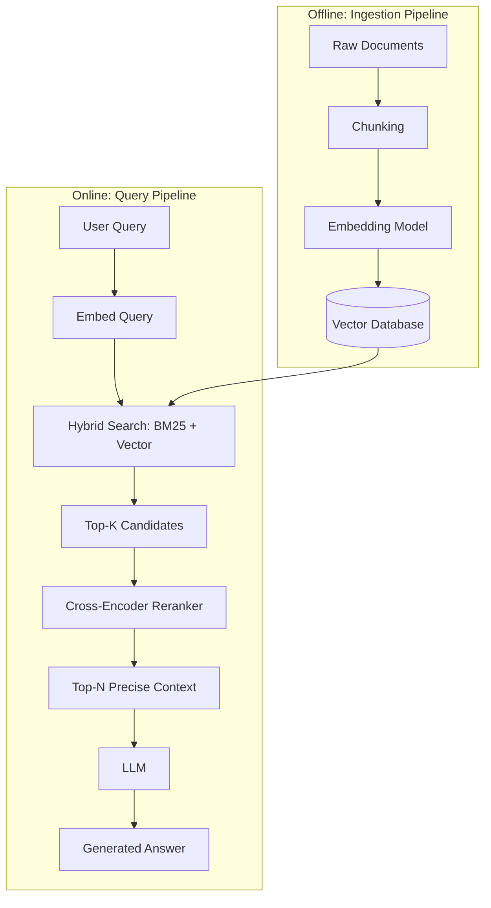

# RAG Fundamentals — Beginner Notes & Interview Prep

A structured set of notes covering Retrieval-Augmented Generation (RAG) from first principles — how documents get ingested, chunked, embedded, retrieved, reranked, and stored — written to be useful both as a learning path and as interview prep.

Every file follows the same structure: **core concept → worked example → diagram → interview Q&A**, so you can either read top to bottom to learn, or jump straight to the Q&A section at the bottom of any file to drill for an interview.

---

## The Big Picture

Every note in this repo is one piece of this diagram, zoomed in.

---

## Learning Path

Read in this order — each file builds on concepts from the ones before it.

| # | File | Covers |
|---|---|---|
| 1 | [`01_document_ingestion_and_chunking.md`](notes/01_document_ingestion_and_chunking.md) | Extracting content from raw documents; chunking strategies (fixed-size, recursive, hierarchical, semantic) and how to choose between them. |
| 2 | [`02_retrieval_methods.md`](notes/02_retrieval_methods.md) | The full retrieval pipeline — ANN indexes (HNSW/IVF), hybrid search, reranking, caching, and the SLOs (latency, freshness, security, availability) that constrain production systems. |
| 3 | [`03_tf_idf.md`](notes/03_tf_idf.md) | The classic keyword-scoring algorithm — term frequency, inverse document frequency, and why it's the foundation of sparse retrieval. |
| 4 | [`04_bm25.md`](notes/04_bm25.md) | TF-IDF's modern successor — fixes length bias and keyword stuffing via saturation (`k1`) and length normalization (`b`). |
| 5 | [`05_keyword_vs_semantic_search.md`](notes/05_keyword_vs_semantic_search.md) | Side-by-side comparison of exact-match vs. meaning-based retrieval, and why hybrid search combines both. |
| 6 | [`06_limitations_of_keyword_search.md`](notes/06_limitations_of_keyword_search.md) | The inverted index data structure, and the four failure modes of keyword-only search (lexical mismatch, polysemy, passage granularity, noisy language). |
| 7 | [`07_embedding_models.md`](notes/07_embedding_models.md) | How text becomes a vector — tokenization, transformer encoding, pooling — and how to choose an embedding model. |
| 8 | [`08_sentence_transformers.md`](notes/08_sentence_transformers.md) | Why raw BERT isn't enough for sentence similarity, the dual-encoder architecture, and dual-encoder vs. cross-encoder. |
| 9 | [`09_similarity_calculations.md`](notes/09_similarity_calculations.md) | The math behind "how similar are these two vectors" — cosine similarity, worked by hand, and why it beats Euclidean distance for text. |
| 10 | [`10_vector_databases.md`](notes/10_vector_databases.md) | Where embeddings actually live — vector DB architecture, ANN indexing at scale, and how to choose a tool (Pinecone, Weaviate, Milvus, Qdrant, pgvector, Chroma, FAISS). |
| 11 | [`11_reranking.md`](notes/11_reranking.md) | The precision stage after retrieval — cross-encoder scoring, why it's a separate stage, and when it's worth the extra latency. |

---

## If You Only Have Time to Prep for an Interview

Read the Q&A section at the bottom of each file — they're written to be answerable out loud, not just recognized when read. If you're short on time, prioritize these five, since they cover the concepts most likely to come up:

1. **BM25** (#4) — the saturation/length-normalization trade-off is a very common "explain this algorithm" question.
2. **Keyword vs. Semantic Search** (#5) — the "when would you use X over Y" framing shows up constantly.
3. **Sentence Transformers** (#8) — dual-encoder vs. cross-encoder is one of the highest-value distinctions in this whole set.
4. **Similarity Calculations** (#9) — being able to explain (or compute) cosine similarity by hand is a strong signal of real understanding, not memorization.
5. **Vector Databases** (#10) — "why would you pick tool X" questions are common in system-design-style interviews.

---

## How to Use This Repo

- Each `notes/*.md` file is self-contained — you can read them out of order, but concepts build cumulatively, so first-time learners should follow the numbered path.
- Mermaid diagrams render automatically on GitHub — no extra setup needed.
- Every file ends with a **Quick Recap** (for review) and an **Interview Q&A Quick-Fire** (for drilling).
